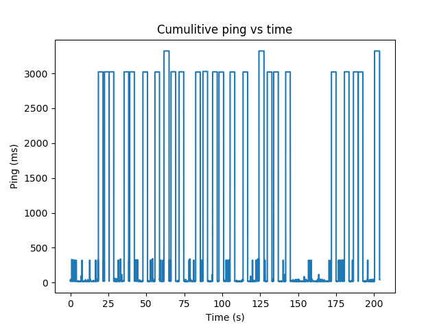
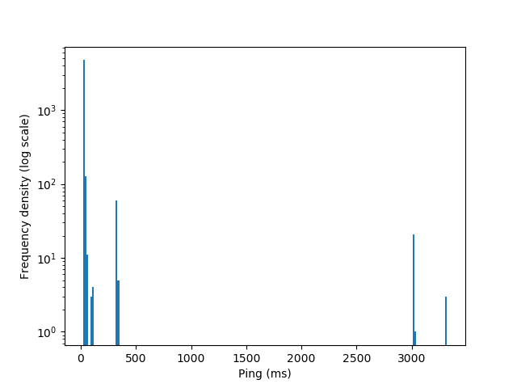
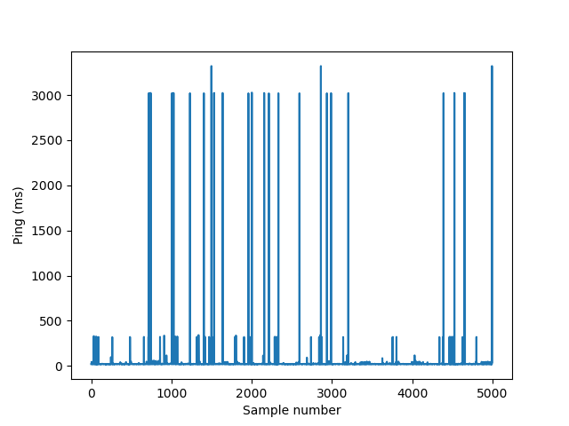

# Internet-connection-JB
The internet at josephine butler has got serious issues for playing competitive multiplayer games like counter-strike or dota.
The quality of an internet connection can be charictorised by three factors throughput, latencey, and loss.

## Throughput

The throughput is how much data you can transmit per second - the rate of data flow total.
The throughput of the connection at josephine butler is very high - this is not an issue at all. If the throughput was low - or many people were using it at once it could be an issue, but that's generaly not the case.
## Latency
The latency of a connection is how long it takes for a message to propogate through the network - the amount of time it takes to get to it's desination.
Latency is commomnly measured in "ping time" the time it takes for a single round trip.
You measure how much time passes between me sending a signal to an outside connection - and then the outside connection replying.
The latency at butler is generaly good ~20ms but it commonly spikes up into increadibly high numbers.
The latency is the largest issue for playing games - if the latency is too high then the game can't make the ilusion that everybody is the same game at the same time and it stops.
## Loss
Packet loss is the idea that data can be lost on the internet - whether it gets blocked or it hits a router that doesn't have the capacity for it. Normal networks operate at very low loss - maybe 1%.  

# Data collected
Using PsPing I collected around 5000 data points - checking the latency to various google.co.uk servers (i.e. the one picked by dns resolution).
The ping traffic was done over TCP due to JANet blocking ICMP traffic.  
These plots show that most of the time latency is low ~ 20ms.
On the other hand the average ping is around ~40ms with a standard deviation of 217ms!
This stacks up to be almost equal to the latency of 4G connections ~53ms [source](https://www.ofcom.org.uk/about-ofcom/latest/media/media-releases/2015/4g-outperforms-3g).

This shows that the network can provide high speed connections - but that it is wildley variable.
If you take 100ms as a threshold for poor latency (DSL connection) - then you can split the data into high and low speed connection times.
Around 1.9% of packets were in this band - but they constituted around 48% of the time spent on the connection. Counterstrike reports ~10% loss intermitetly.
# Plots
Weighted representation of how long was spent at a specific latency time (height of sample is the width of it's bar)

Log histogram plot of the latenecy

Raw samples and their latencies.
